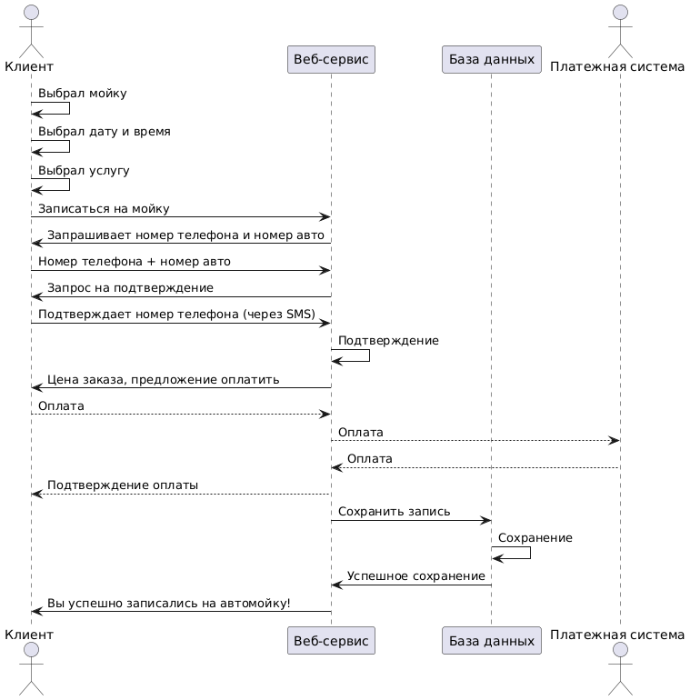
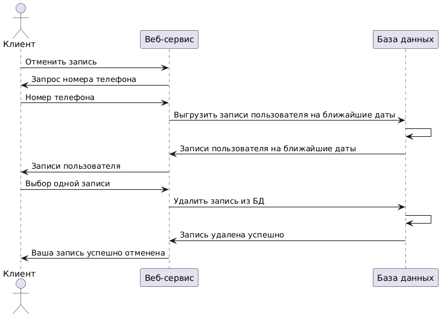
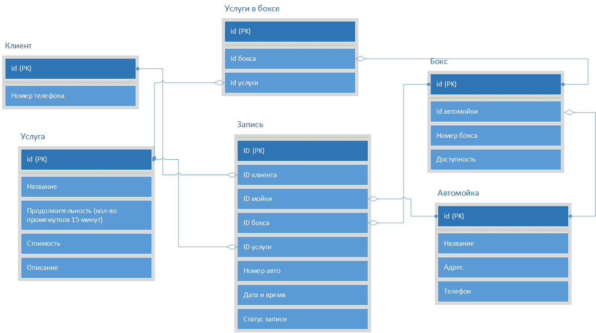
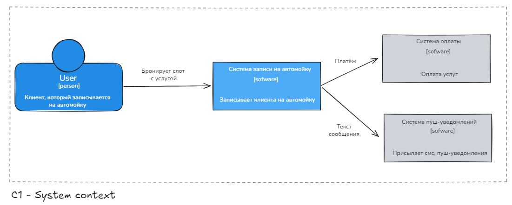
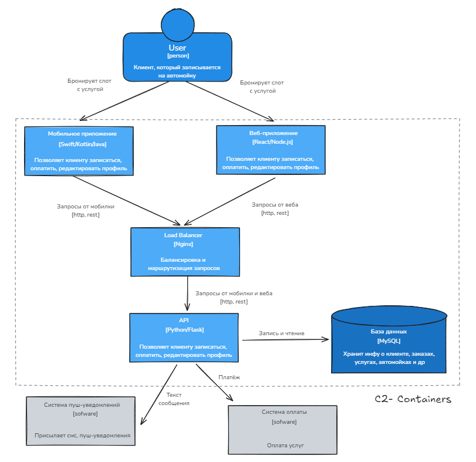

<h1 style="text-align:center">Интеграция информационных систем</h1>

<h2>Проект сервиса записи на автомойку</h2>

<h3>TODO</h3>
<ul>
	<li>+ Написать альтернативные сценарии в Use Case </li>
	<li>+ Написать различные User Story</li>
	<li>+Описать как работает сервис с точки зрения архитектуры (Sequence диаграмма в файле работа_сервиса.txt)</li>	
	<li>+Придумать архитектуру БД (ER-диаграмма)</li>
	<li>Сделать спецификацию openapi swagger</li>
</ul>

## Блок с User Story

Я как автовладелец хочу легко и быстро записаться на мойку на удобное время, чтобы не сильно думать об это процессе.

Я как пользователь приложения хочу удобный и понятный интерфейс, чтобы я мог приятно пользоваться сервисол. Хочу видеть мойку, услуги, которые она оказывает, и свободные слоты.

Я как ленивый человек хочу оплатить услугу заранее, чтобы не думать об этом.

Я, как любитель планировать день, хочу заранее узнать, что мойка не сможет оказать услугу в указанное мной время, чтобы не приезжать напрасно.

Я, как вежливый человек, хочу отменить свою запись, если не смогу приехать на мойку, чтобы предупредить вдминистраторов.

Я, как постоянный клиент, хочу систему скидок, чтобы я приезжал снова.

Я, как любитель отойти, хочу уведомление на телефон, когда услуга будет завершена, чтобы постоянно не следить за выполнением услуги.

<h3>Функциональные требования к сервису, что он может (рис. 1)</h3>

Код этой Use-Case диаграммы для редактора PlantUML находится в файле functional_requirements.md

Исходные данные:  
Регион: Сахалинская область 
Численность региона: 500к человек 
DAU (количество активных польз-лей в день): 15% = 75к 
RPS(запросов в сек): 75000/24/3600 = 1 

	
<h3>Сценарии использования:</h3>

 <h4>UC1: Записаться на мойку </h4>
	
<i>Участники</i>: пользователь приложения

	
<i>Предусловия</i>: пользователь выбрал автомойку из списка, выбрал дату и время, выбрал услугу.

	
<i>Условия для запуска сценария</i>: пользователь приложения нажал кнопку "Записаться"

	
<i>Признак успешности</i>: Пользователь записался на мойку, выходит окно "Вы успешно записаны на автомойку!".

	
<i>Базовый сценарий:</i>

	<ol>
		<li>Система находит указанную мойку в БД и выводит услуги, которые она предоставляет</li>
		<li>Пользователь выбирает услугу.</li>
		<li>Пользователь оставляет имя, номер авто, номер телефона для связи</li>
	</ol>

<i>Альтернативный сценарий 1.</i> Нет соединения с Интернетом:

	<ol>		
		<li>Выдать пользователю ошибку соединения. Можно позвонить администратору мойки и записаться.</li>
	</ol>

<i>Альтернативный сценарий 2.</i> Ошибка на сервере.

	<ol>		
		<li>Сказать пользователю, что сейчас технические неполадки в системе. Попросить зайти позже. (Возможно попросить позвонить администратору и записаться)</li>
	</ol>

<i>Альтернативный сценарий 3.</i> Выбранная услуга временно не оказывается

	<ol>		
		<li>Сказать, что выбранная услуга временно не оказывается, и предложить пользователю выбрать другую услугу, либо другой бокс, либо другую автомойку</li>
	</ol>
 
<h4> UC1_2: Найти и выбрать автомойку</h4>
	
Участники: пользователь приложения

	
Предусловия: пользователь зашел в приложение

	
Условия для запуска сценария: пользователь приложения нажимает кнопку "Найти мойку"

	
Признак успешности: Пользователь видит список моек на экране и выбирает одну

	
<i>Базовый сценарий:</i>

	<ol>
		<li>Система предлагает использовать геолокацию пользователя</li>
		<li>Если пользователь согласился дать геолокацию:
			<ul>
				<li>Система ищет ближайшие к нему автомойки</li>
				<li>Система возвращает карту или список ближайших автомоек</li>
			</ul>
		 </li>
		 <li>Если пользователь отказался:
			<ul>
				<li>Система выводит список всех автомоек либо показывает карту.</li>
			</ul>
		 </li>
		<li>Пользователь выбирает автомойку из списка или указывает ее на карте.</li>
	</ol>
	
<i>Альтернативный сценарий 1.</i> Нет соединения с Интернетом:

	<ol>		
		<li>Выдать пользователю ошибку соединения</li>
	</ol>
	
<i>Альтернативный сценарий 2.</i> Ошибка на сервере.

	<ol>		
		<li>Сказать пользователю, что сейчас технические неполадки в системе. Попросить зайти позже. (Возможно попросить позвонить администратору определенной мойки и записаться)</li>
	</ol>
	
<i>Альтернативный сценарий 3.</i> Выбранная мойка закрыта

	<ol>		
		<li>Сказать, что мойка закрыта (по тем или иным причинам) и предложить пользователю выбрать другую автомойку</li>
	</ol>

<h4> UC3: Выбрать дату и время</h4>
	
<i>Участники</i>: пользователь приложения

	
<i>Предусловия</i>: пользователь выбрал автомойку из списка

	
<i>Условия для запуска сценария</i>: пользователь приложения нажимает кнопку "Выбрать время"

	
<i>Признак успешности</i>: Пользователь видит список свободных слотов на запись

	
<i>Базовый сценарий:</i>

	<ol>
		<li>Система находит указанную мойку в БД и выводит даты, на которые можно записаться</li>
		<li>Пользователь выбирает определенную дату из списка</li>
	</ol>
	

<i>Альтернативный сценарий 1.</i> Нет соединения с Интернетом:

	<ol>		
		<li>Выдать пользователю ошибку соединения. Можно позвонить администратору мойки и записаться.</li>
	</ol>

<i>Альтернативный сценарий 2.</i> Ошибка на сервере.

	<ol>		
		<li>Сказать пользователю, что сейчас технические неполадки в системе. Попросить зайти позже. (Возможно попросить позвонить администратору и записаться)</li>
	</ol>	

<i>Альтернативный сценарий 3.</i> Все слоты на выбранной мойке заняты

	<ol>		
		<li>Сказать, что все места заняты, и предложить пользователю выбрать другую автомойку</li>
	</ol>

<h4> UC4: Выбрать услугу</h4>
	
<i>Участники</i>: пользователь приложения

	
<i>Предусловия</i>: пользователь выбрал автомойку из списка, выбрал дату и время

	
<i>Условия для запуска сценария</i>: пользователь приложения нажал кнопку "Записаться"

	
<i>Признак успешности</i>: Пользователь видит список услуг на данной мойке, их стоимость и выбирает.

	
<i>Базовый сценарий:</i>

	<ol>
		<li>Система находит указанную мойку в БД и выводит услуги, которые она предоставляет</li>
		<li>Пользователь выбирает услугу.</li>
		<li>Пользователь оставляет имя, номер авто, номер телефона для связи</li>
	</ol>

<i>Альтернативный сценарий 1.</i> Нет соединения с Интернетом:

	<ol>		
		<li>Выдать пользователю ошибку соединения. Можно позвонить администратору мойки и записаться.</li>
	</ol>

<i>Альтернативный сценарий 2.</i> Ошибка на сервере.

	<ol>		
		<li>Сказать пользователю, что сейчас технические неполадки в системе. Попросить зайти позже. (Возможно попросить позвонить администратору и записаться)</li>
	</ol>

<i>Альтернативный сценарий 3.</i> Выбранная услуга временно не оказывается

	<ol>		
		<li>Сказать, что выбранная услуга временно не оказывается, и предложить пользователю выбрать другую услугу, либо другой бокс, либо другую автомойку</li>
	</ol>

<h4> UC5: Отменить услугу</h4>
	
<i>Участники</i>: пользователь приложения

	
<i>Предусловия</i>: пользователь выбрал автомойку из списка, выбрал дату и время, выбрал услугу, записался, вышел из приложения. Вернулся через некоторое время.

	
<i>Условия для запуска сценария</i>: пользователь приложения нажал кнопку "Отменить запись"

	
<i>Признак успешности</i>: Запись пользователя отменяется.

	
<i>Базовый сценарий:</i>

	<ol>
		<li>Пользователь вводит номер телефона</li>
		<li>Система находит записи пользователя на будущие даты (с текущей) </li>
		<li>Пользователь выбирает запись и нажимает кнопку "Отменить"</li>
		<li>Ответ системы: "Запись отменена."</li>
	</ol>

<i>Альтернативный сценарий 1.</i> Нет соединения с Интернетом:

	<ol>		
		<li>Выдать пользователю ошибку соединения. Можно позвонить администратору мойки и отменить услугу.</li>
	</ol>

<i>Альтернативный сценарий 2.</i> Ошибка на сервере.

	<ol>		
		<li>Сказать пользователю, что сейчас технические неполадки в системе. Попросить зайти позже. (Возможно попросить позвонить администратору и отменить услугу)</li>
	</ol>	

<i>Альтернативный сценарий 3.</i>Мойка не работает в это время

	<ol>		
		<li>Отправить СМС пользователю. Если он уже оплатил, предложить записать на другое время с сохранением оплаты.</li>
	</ol>	

<h4> UC6: Оплатить</h4>
	
<i>Участники</i>: пользователь приложения

	
<i>Предусловия</i>: пользователь выбрал автомойку из списка, выбрал дату и время, выбрал услугу, записался

	
<i>Условия для запуска сценария</i>: пользователь нажал кнопку "Оплатить заранее"

	
<i>Признак успешности</i>: оплата пользователя прошла успешно

	
<i>Базовый сценарий 1 (пользователь только что записался):</i>

	<ol>
		<li>Пользователю выводится стоимость всех услуг</li>	
		<li>Пользователь способ оплаты, оплачивает</li>
		<li>Ответ системы: "Оплата прошла успешна."</li>
	</ol>			
	
<i>Базовый сценарий: (пользователь записался, но решил оплатить потом)</i>

	<ol>
		<li>Пользователь вводит номер телефона</li>
		<li>Система находит записи пользователя на будущие даты (с текущей) </li>
		<li>Пользователь выбирает запись и нажимает кнопку "Оплатить заранее"</li>
		<li>Пользователю выводится стоимость всех услуг</li>	
		<li>Пользователь способ оплаты, оплачивает</li>
		<li>Ответ системы: "Оплата прошла успешна."</li>
	</ol>

<i>Альтернативный сценарий 1.</i> Нет соединения с Интернетом:

	<ol>		
		<li>Выдать пользователю ошибку соединения. Сказать, что оплатить можно при оказании услуги</li>
	</ol>

<i>Альтернативный сценарий 2.</i> Ошибка на сервере.

	<ol>		
		<li>Сказать пользователю, что сейчас технические неполадки в системе. Попросить зайти позже либо оплатить непосредственно на мойке</li>
	</ol>

<h3>Работа сервиса по записи на мойку и возможной оплате (с прогнозом погоды пока не уверен)</h3>

Код для диаграммы расположен в файле работа_сервиса.md

<h3>Отмена записи на мойку</h3>

Код для диаграммы расположен в файле работа_сервиса.md

<h3>ER-диграмма (структура базы данных)</h3>

Структура БД описана в файле diagrams/автомойка_бд.vsdx

<h3>C4 модель</h3>

Уровень С1

  

Уровень С2

