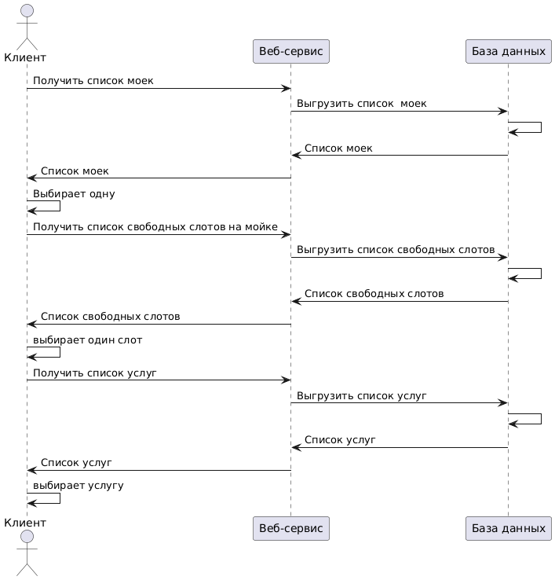

<h1 style="text-align:center">Интеграция информационных систем</h1>

<h2>Проект сервиса записи на автомойку</h2>

<h3>Что присутствует❗</h3>
<ul>
	<li>Use Case диаграмма </li>
	<li>Блок с User Story</li>
	<li>Сценарии использования</li>
	<li>Sequence диаграммы, 3 варианта</li>	
	<li>ER-диаграмма</li>
	<li>C4 модель (уровни C1 и C2)</li>
	<li>Спецификация OpenAPI Swagger, файл openapi.yaml</li>
</ul>

## Блок с User Story 🚗

Я как автовладелец хочу легко и быстро записаться на мойку на удобное время, чтобы не сильно думать об это процессе.

Я как пользователь приложения хочу удобный и понятный интерфейс, чтобы я мог приятно пользоваться сервисом. Хочу видеть мойку, услуги, которые она оказывает, и свободные слоты.

Я как ленивый человек хочу оплатить услугу заранее, чтобы не думать об этом.

Я, как любитель планировать день, хочу заранее узнать, что мойка не сможет оказать услугу в указанное мной время, чтобы не приезжать напрасно.

Я, как вежливый человек, хочу отменить свою запись, если не смогу приехать на мойку, чтобы предупредить администраторов и освободить слот.

Я, как постоянный клиент, хочу систему скидок, чтобы я приезжал снова.

Я, как любитель отойти, хочу уведомление на телефон, когда услуга будет завершена, чтобы постоянно не следить за выполнением услуги.

<h3>Функциональные требования к сервису, что он может (рис. 1)</h3>

Код этой Use-Case диаграммы для редактора PlantUML находится в файле <a href="functional_requirements.md">functional_requirements.md</a>

Исходные данные:  
<table>
	<tr><td><i>Регион</i></td><td>Сахалинская область</td></tr>
	<tr><td><i>Численность региона</i></td><td>500к человек</td></tr>
	<tr><td><i>DAU (количество активных польз-лей в день)</i></td><td>15% = 75к</td></tr>
	<tr><td><i>RPS(запросов в сек)</i></td><td>75000/24/3600 = 1 </td></tr>
</table>

	
<h3>Сценарии использования: 🎬</h3>

 <h4>UC1: Записаться на мойку </h4>
	<table>
	<tr><td><i>Участники</i></td><td>пользователь приложения</td></tr>
	<tr><td><i>Предусловия</i></td><td>пользователь выбрал автомойку из списка, выбрал дату и время, выбрал услугу, ввел данные, подтвердил номер телефона (возможно оплатил)</td></tr>
	<tr><td><i>Условия для запуска сценария</i></td><td>пользователь приложения нажал кнопку "Записаться", ввел данные, подтвердил номер телефона (возможно оплатил)</td></tr>
	<tr><td><i>Признак успешности </i></td><td>Пользователь записался на мойку, выходит окно "Вы успешно записаны на автомойку!"</td></tr>
	</table>
	
<i>✅ Базовый сценарий:</i>

	<ol>
		<li>Выходит окно, что пользователь успешно записался на автомойку, все данные сохранены.</li>
	</ol>

<i>🛑 Альтернативный сценарий 1.</i> Нет соединения с Интернетом:

	<ol>		
		<li>Выдать пользователю ошибку соединения. Можно позвонить администратору мойки и записаться.</li>
	</ol>

<i>🛑 Альтернативный сценарий 2.</i> Ошибка на сервере.

	<ol>		
		<li>Сказать пользователю, что сейчас технические неполадки в системе. Попросить зайти позже. (Возможно попросить позвонить администратору и записаться)</li>
	</ol>
 
<h4> UC1_1: Найти и выбрать автомойку</h4>
	<table>
	<tr><td><i>Участники</i></td><td>пользователь приложения</td></tr>
	<tr><td><i>Предусловия</i></td><td>пользователь зашел в приложение</td></tr>
	<tr><td><i>Условия для запуска сценария</i></td><td>пользователь приложения нажимает кнопку "Найти мойку"</td></tr>
	<tr><td><i>Признак успешности</i></td><td>Пользователь видит список моек на экране и выбирает одну</td></tr>
	</table>	
	
<i>✅ Базовый сценарий:</i>

	<ol>
		<li>Система предлагает использовать геолокацию пользователя</li>
		<li>Если пользователь согласился дать геолокацию:
			<ul>
				<li>Система ищет ближайшие к нему автомойки</li>
				<li>Система возвращает карту или список ближайших автомоек</li>
			</ul>
		 </li>
		 <li>Если пользователь отказался:
			<ul>
				<li>Система выводит список всех автомоек либо показывает карту.</li>
			</ul>
		 </li>
		<li>Пользователь выбирает автомойку из списка или указывает ее на карте.</li>
	</ol>
	
<i>🛑 Альтернативный сценарий 1.</i> Нет соединения с Интернетом:

	<ol>		
		<li>Выдать пользователю ошибку соединения</li>
	</ol>
	
<i>🛑 Альтернативный сценарий 2.</i> Ошибка на сервере.

	<ol>		
		<li>Сказать пользователю, что сейчас технические неполадки в системе. Попросить зайти позже. (Возможно попросить позвонить администратору определенной мойки и записаться)</li>
	</ol>
	
<i>🛑 Альтернативный сценарий 3.</i> Выбранная мойка закрыта

	<ol>		
		<li>Сказать, что мойка закрыта (по тем или иным причинам) и предложить пользователю выбрать другую автомойку</li>
	</ol>

<h4> UC1.2: Выбрать дату и время</h4>
	<table>
	<tr><td><i>Участники</i></td><td>пользователь приложения</td></tr>
	<tr><td><i>Предусловия</i></td><td>пользователь выбрал автомойку из списка

	<tr><td><i>Условия для запуска сценария</i></td><td>пользователь приложения нажимает кнопку "Выбрать время"</td></tr>
	<tr><td><i>Признак успешности</i></td><td>Пользователь видит список свободных слотов на запись</td></tr>
	</table>
	
<i>✅ Базовый сценарий:</i>

	<ol>
		<li>Система находит указанную мойку в БД и выводит даты, на которые можно записаться</li>
		<li>Пользователь выбирает определенную дату из списка</li>
	</ol>
	

<i>🛑 Альтернативный сценарий 1.</i> Нет соединения с Интернетом:

	<ol>		
		<li>Выдать пользователю ошибку соединения. Можно позвонить администратору мойки и записаться.</li>
	</ol>

<i>🛑 Альтернативный сценарий 2.</i> Ошибка на сервере.

	<ol>		
		<li>Сказать пользователю, что сейчас технические неполадки в системе. Попросить зайти позже. (Возможно попросить позвонить администратору и записаться)</li>
	</ol>	

<i>🛑 Альтернативный сценарий 3.</i> Все слоты на выбранной мойке заняты

	<ol>		
		<li>Сказать, что все места заняты, и предложить пользователю выбрать другую автомойку</li>
	</ol>

<h4> UC1.3: Выбрать услугу </h4>
	<table>
	<tr><td><i>Участники</i></td><td>пользователь приложения</td></tr>
	<tr><td><i>Предусловия</i></td><td>пользователь выбрал автомойку из списка, выбрал дату и время</td></tr>
	<tr><td><i>Условия для запуска сценария</i></td><td>пользователь приложения нажал кнопку "Выбрать услугу"</td></tr>
	<tr><td><i>Признак успешности</i></td><td>Пользователь видит список услуг на данной мойке, их стоимость и выбирает.</td></tr>
	</table>		
	
<i>✅ Базовый сценарий:</i>

	<ol>
		<li>Система находит указанную мойку в БД и выводит услуги, которые она предоставляет</li>
		<li>Пользователь выбирает услугу.</li>
	</ol>

<i>🛑 Альтернативный сценарий 1.</i> Нет соединения с Интернетом:

	<ol>		
		<li>Выдать пользователю ошибку соединения. Можно позвонить администратору мойки и записаться.</li>
	</ol>

<i>🛑 Альтернативный сценарий 2.</i> Ошибка на сервере.

	<ol>		
		<li>Сказать пользователю, что сейчас технические неполадки в системе. Попросить зайти позже. (Возможно попросить позвонить администратору и записаться)</li>
	</ol>

<i>🛑 Альтернативный сценарий 3.</i> Выбранная услуга временно не оказывается

	<ol>		
		<li>Сказать, что выбранная услуга временно не оказывается, и предложить пользователю выбрать другую услугу, либо другой бокс, либо другую автомойку</li>
	</ol>

<h4> UC1.4: Подтвердить запись</h4>
	<table>
	<tr><td><i>Участники</i></td><td>пользователь приложения</td></tr>
	<tr><td><i>Предусловия</i></td><td>пользователь выбрал автомойку из списка, выбрал дату и время, выбрал услугу</td></tr>
	<tr><td><i>Условия для запуска сценария</i></td><td>пользователь нажал кнопку "Записаться"</td></tr>
	<tr><td><i>Признак успешности</i></td><td>пользователь ввел свои данные (номер телефона, номер авто) и подтвердил номер телефона</td></tr>
	</table>	
	
<i>✅ Базовый сценарий:</i>

	<ol>
		<li>Система просит ввести номер телефона, номер авто.</li>
		<li>Пользователь вводит данные</li>
		<li>Номер телефона подтверждается (по SMS или звонку) </li>
	</ol>	

<i>🛑 Альтернативный сценарий 1.</i> Нет соединения с Интернетом:

	<ol>		
		<li>Выдать пользователю ошибку соединения. Сказать, что оплатить можно при оказании услуги</li>
	</ol>

<i>🛑 Альтернативный сценарий 2.</i> Ошибка на сервере.

	<ol>		
		<li>Сказать пользователю, что сейчас технические неполадки в системе. Попросить зайти позже либо оплатить непосредственно на мойке</li>
	</ol>
	

<i>🛑 Альтернативный сценарий 2.</i> Ошибка на сервере.

	<ol>		
		<li>Сказать пользователю, что сейчас технические неполадки в системе. Попросить зайти позже либо оплатить непосредственно на мойке</li>
	</ol>

<i>🛑 Альтернативный сценарий 4.</i> Невозможно подтвердить номер телефона или пользователь ввел не тот.

	<ol>		
		<li>Попросить ввести другой номер телефона либо отменить запись, вернуться на главный экран.</li>
	</ol>

<h4> UC1.5: Оплатить</h4>
	<table>
	<tr><td><i>Участники</i></td><td>пользователь приложения</td></tr>
	<tr><td><i>Предусловия</i></td><td>пользователь выбрал автомойку из списка, выбрал дату и время, выбрал услугу, ввел данные, подтвердил номер телефона</td></tr>
	<tr><td><i>Условия для запуска сценария</i></td><td>пользователь нажал кнопку "Записаться", ввел данные и подтвердил номер телефона</td></tr>
	<tr><td><i>Признак успешности</i></td><td>оплата пользователя прошла успешно либо пользователь предпочел оплатить на месте.</td></tr>
	</table>
	
<i>✅ Базовый сценарий 1: пользователь оплатит онлайн:</i>

	<ol>
		<li>Пользователю выводится стоимость всех услуг</li>	
		<li>Пользователь выбирает способ оплаты, оплачивает</li>
		<li>Ответ системы: "Оплата прошла успешна."</li>
	</ol>			
	
<i>✅ Базовый сценарий 2: пользователь оплатит на мойке</i>

	<ol>	
		<li>Пользователю выводится стоимость всех услуг</li>	
		<li>Пользователь нажимает кнопку "Оплатить на мойке" </li>
		<li>Ответ системы: "ОК"</li>
	</ol>

<i>🛑 Альтернативный сценарий 1.</i> Нет соединения с Интернетом:

	<ol>		
		<li>Выдать пользователю ошибку соединения. Сказать, что оплатить можно при оказании услуги</li>
	</ol>

<i>🛑 Альтернативный сценарий 2.</i> Ошибка на сервере.

	<ol>		
		<li>Сказать пользователю, что сейчас технические неполадки в системе. Попросить зайти позже либо оплатить непосредственно на мойке</li>
	</ol>

<i>🛑 Альтернативный сценарий 3.</i> Ошибка оплаты

	<ol>		
		<li>Передать пользователю, что оплата не прошла, попросить оплатить лично на мойке либо попробовать еще раз.</li>
	</ol>

<h4> UC2: Отменить услугу</h4>
<table>
	<tr><td><i>Участники</i></td><td>пользователь приложения</td></tr>
	<tr><td><i>Предусловия</i></td><td>пользователь записался на мойку</td></tr>
	<tr><td><i>Условия для запуска сценария</i></td><td>пользователь приложения нажал кнопку "Отменить запись"</td></tr>
	<tr><td><i>Признак успешности</i></td><td>Запись пользователя отменяется.</td></tr>
	</table>	
	
<i>✅ Базовый сценарий:</i>

	<ol>
		<li>Пользователь вводит номер телефона и подтверждает его.</li>
		<li>Система находит записи пользователя на будущие даты (с текущей) </li>
		<li>Пользователь выбирает запись и нажимает кнопку "Отменить"</li>
		<li>Ответ системы: "Запись отменена."</li>
	</ol>

<i>🛑 Альтернативный сценарий 1./i> Нет соединения с Интернетом:

	<ol>		
		<li>Выдать пользователю ошибку соединения. Можно позвонить администратору мойки и отменить услугу.</li>
	</ol>

<i>🛑 Альтернативный сценарий 2.</i> Ошибка на сервере.

	<ol>		
		<li>Сказать пользователю, что сейчас технические неполадки в системе. Попросить зайти позже. (Возможно попросить позвонить администратору и отменить услугу)</li>
	</ol>	

<i>🛑 Альтернативный сценарий 3.</i> Мойка не работает в это время

	<ol>		
		<li>Отправить СМС пользователю. Если он уже оплатил, предложить записать на другое время с сохранением оплаты.</li>
	</ol>	

<h3>Sequence diagram для UC1.1, UC1.2, UC1.3. Подготовка к записи на автомойку.</h3>

Код для диаграммы расположен в файле <a href="работа_сервиса.md">работа_сервиса.md</a>

<h3>Работа сервиса по записи на мойку и возможной оплате</h3>

Код для диаграммы расположен в файле <a href="работа_сервиса.md">работа_сервиса.md</a>

<h3>Отмена записи на мойку</h3>

Код для диаграммы расположен в файле <a href="работа_сервиса.md">работа_сервиса.md</a>

<h3>ER-диграмма (структура базы данных)</h3>

Структура БД описана в файле diagrams/автомойка_бд.vsdx

<h3>C4 модель</h3>

Уровень С1

  

Уровень С2

