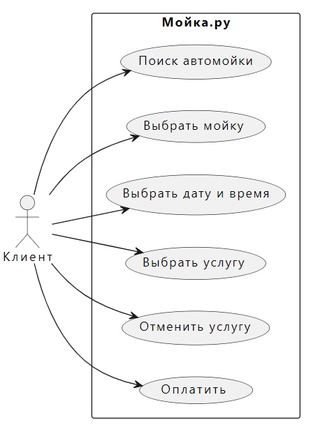

<h1 style="text-align:center">Интеграция информационных систем</h1>

<h2>Проект сервиса записи на автомойку</h2>

<h3>TODO</h3>
<ul>
	<li>Написать альтернативные сценарии в Use Case</li>
	<li>Написать различные User Story</li>
	<li>Описать как работает сервис (с точки зрения архитектуры в файле работа_сервиса.txt)</li>	
	<li>Придумать архитектуру БД</li>
</ul>

<h3>Функциональные требования к сервису, что он может (рис. 1)</h3>

Код этой Use-Case диаграммы для редактора PlantUML находится в файле functional_requirements.md

Исходные данные:  
Регион: Сахалинская область 
Численность региона: 500к человек 
DAU (количество активных польз-лей в день): 15% = 75к 
RPS(запросов в сек): 75000/24/3600 = 1 

<h3>Сценарии использования:</h3>
<h4> UC1_2: Найти и выбрать автомойку</h4>
	
Участники: пользователь приложения

	
Предусловия: пользователь зашел в приложение

	
Условия для запуска сценария: пользователь приложения нажимает кнопку "Найти мойку"

	
Признак успешности: Пользователь видит список моек на экране и выбирает одну

	
<i>Базовый сценарий:</i>

	<ol>
		<li>Система предлагает использовать геолокацию пользователя</li>
		<li>Если пользователь согласился дать геолокацию:
			<ul>
				<li>Система ищет ближайшие к нему автомойки</li>
				<li>Система возвращает карту или список ближайших автомоек</li>
			</ul>
		 </li>
		 <li>Если пользователь отказался:
			<ul>
				<li>Система выводит список всех автомоек либо показывает карту.</li>
			</ul>
		 </li>
		<li>Пользователь выбирает автомойку из списка или указывает ее на карте.</li>
	</ol>

<h4> UC3: Выбрать дату и время</h4>
	
<i>Участники</i>: пользователь приложения

	
<i>Предусловия</i>: пользователь выбрал автомойку из списка

	
<i>Условия для запуска сценария</i>: пользователь приложения нажимает кнопку "Выбрать время"

	
<i>Признак успешности</i>: Пользователь видит список свободных слотов на запись

	
<i>Базовый сценарий:</i>

	<ol>
		<li>Система находит указанную мойку в БД и выводит даты, на которые можно записаться</li>
		<li>Пользователь выбирает определенную дату из списка</li>
	</ol>

<h4> UC4: Выбрать услугу</h4>
	
<i>Участники</i>: пользователь приложения

	
<i>Предусловия</i>: пользователь выбрал автомойку из списка, выбрал дату и время

	
<i>Условия для запуска сценария</i>: пользователь приложения нажал кнопку "Записаться"

	
<i>Признак успешности</i>: Пользователь видит список услуг на данной мойке, их стоимость и выбирает.

	
<i>Базовый сценарий:</i>

	<ol>
		<li>Система находит указанную мойку в БД и выводит услуги, которые она предоставляет</li>
		<li>Пользователь выбирает услугу.</li>
		<li>Пользователь оставляет имя, номер авто, номер телефона для связи</li>
	</ol>

<h4> UC5: Отменить услугу</h4>
	
<i>Участники</i>: пользователь приложения

	
<i>Предусловия</i>: пользователь выбрал автомойку из списка, выбрал дату и время, выбрал услугу, записался, вышел из приложения. Вернулся через некоторое время.

	
<i>Условия для запуска сценария</i>: пользователь приложения нажал кнопку "Отменить запись"

	
<i>Признак успешности</i>: Запись пользователя отменяется.

	
<i>Базовый сценарий:</i>

	<ol>
		<li>Пользователь вводит номер телефона</li>
		<li>Система находит записи пользователя на будущие даты (с текущей) </li>
		<li>Пользователь выбирает запись и нажимает кнопку "Отменить"</li>
		<li>Ответ системы: "Запись отменена."</li>
	</ol>

<h4> UC6: Оплатить</h4>
	
<i>Участники</i>: пользователь приложения

	
<i>Предусловия</i>: пользователь выбрал автомойку из списка, выбрал дату и время, выбрал услугу, записался

	
<i>Условия для запуска сценария</i>: пользователь нажал кнопку "Оплатить заранее"

	
<i>Признак успешности</i>: оплата пользователя прошла успешно

	
<i>Базовый сценарий 1 (пользователь только что записался):</i>

	<ol>
		<li>Пользователю выводится стоимость всех услуг</li>	
		<li>Пользователь способ оплаты, оплачивает</li>
		<li>Ответ системы: "Оплата прошла успешна."</li>
	</ol>			
	
<i>Базовый сценарий: (пользователь записался, но решил оплатить потом)</i>

	<ol>
		<li>Пользователь вводит номер телефона</li>
		<li>Система находит записи пользователя на будущие даты (с текущей) </li>
		<li>Пользователь выбирает запись и нажимает кнопку "Оплатить заранее"</li>
		<li>Пользователю выводится стоимость всех услуг</li>	
		<li>Пользователь способ оплаты, оплачивает</li>
		<li>Ответ системы: "Оплата прошла успешна."</li>
	</ol>